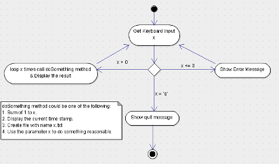

# Assignment 1

### 1. What is JDK? JRE? JVM?
* JRE: is the JVM program, Java application need to run on JRE.
* JDK: contains the tools for developing Java programs running on JRE, for example, it provides the compiler “javac”.
* JVM: the Java Virtual Machine (JVM) is an abstract computing machine. The JVM is a program that looks like a machine to the programs written to execute in it.
### 2.	What is java compiler?
* A Java compiler is a program that takes the text file work of a developer and compiles it into a platform-independent Java file. For example, Java Programming Language Compiler(javac)
### 3.	Why is java platform independent?
* Java is platform-independent because it uses a virtual machine. The Java programming language and all APIs are compiled into bytecodes. Bytecodes are effectively platform-independent. The virtual machine takes care of the differences between the bytecodes for the different platforms.
* The run-time requirements for Java are therefore very small. The Java virtual machine takes care of all hardware-related issues, so that no code has to be compiled for different hardware.
### 4.	What is IDE? Why is it important for developers?
* An integrated development environment (IDE) is software for building applications that combines common developer tools into a single graphical user interface (GUI).
* IDEs increase programmer productivity by combining common activities of writing software into a single application: editing source code, building executables, and debugging.
### 5.	Is java case sensitive?
* Yes, Java is a case-sensitive language, which means that the upper or lower case of letters in your Java programs matter.
### 6.	What do the following key words do? static, final, public, private, void, null, package, Class, new
* static: Attributes and methods belongs to the class, rather than an object
* final: Attributes and methods cannot be overridden or modified.
* public: The access level of a public modifier is everywhere. It can be accessed from within the class, outside the class, within the package and outside the package.
* private: The access level of a private modifier is only within the class. It cannot be accessed from outside the class.
* void: The void keyword specifies that a method should not have a return value.
* null: null is a reserved word for literal values. It seems like a keyword, but actually, it is a literal similar to true and false.
* package: The package keyword creates a package.
* class: The class keyword is used to create a class. A class should always start with an uppercase first letter, and the name of the java file must match the class name.
* new: Used to create an instance of the class. In other words, it instantiates a class by allocating memory for a new object and returning a reference to that memory. We can also use the new keyword to create the array object.
### 7.	What is primitive type and reference type?
* The primitive types are boolean, byte, char, short, int, long, float and double. All other types are reference types, so classes, which specify the types of objects, are reference types.
### 8.	Is parameter passed by value or reference?
* Java always passes parameter variables by value.
* Object variables in Java always point to the real object in the memory heap.
* A mutable object’s value can be changed when it is passed to a method.
* An immutable object’s value cannot be changed, even if it is passed a new value.
### 9.	What is the output: System.out.println(1 > 0 : “A”:”B”);
* error: ')' expected
* if the statement is System.out.println(1 > 0 ? “A”:”B”);, then output would be "A"
### 10.	How to define constants in java?
* (public/private) (static) final TYPE NAME = VALUE;
### 11.	What is String? Is it primitive type?
* In Java, string is basically an object that represents sequence of char values. An array of characters works same as Java string.
* String is not a primitive data type. Java.lang package provides the String class therefore, it is an object type.
### 12.	How to check if a String is representing a number?
* Integer.parseInt()
* Integer.valueOf()
* Double.parseDouble()
* Float.parseFloat()
* Long.parseLong()
* Use regular expressions
### 13.	Write a program to implement the following activity diagram:

```java
public class Assignment1.Assignment1Q13 {
    public static void main(String[] args) {
        Scanner keyboard = new Scanner(System.in);
        System.out.print("enter an integer: ");
        while(keyboard.hasNext()) {

            try {
                if (keyboard.hasNextInt()) {
                    int input = keyboard.nextInt();
                    // System.out.println("You entered: " + input);
                    if (input > 0) {
                        doSomething(input);
                    } else {
                        System.out.println("Error: invalid input number.");
                    }
                } else {
                    if (keyboard.next().equals("q")) {
                        return;
                    }
                }
                System.out.print("enter an integer: ");
            } catch (Exception e) {
                System.out.println(e.getMessage());
                System.out.println(e.fillInStackTrace());
                return;
            }
        }
    }

    private static void doSomething(int x) {
        int res = 0;
        for (int i = 1; i <= x; i++) {
            res += i;
        }
        System.out.println("sum from 1 to " + x + " is: " + res);
        SimpleDateFormat formatter = new SimpleDateFormat("dd/MM/yyyy HH:mm:ss z");
        Date date = new Date();
        System.out.println(formatter.format(date));
    }
}
```

### 14.	Write a program to merge two array of int.
```java
public static int[] merge(int[] a, int[] b) {
        Arrays.sort(a);
        Arrays.sort(b);
        int[] res = new int[a.length + b.length];
        int ap = 0, bp = 0, resp = 0;
        while (ap < a.length && bp < b.length) {
            if (a[ap] < b[bp]) {
                res[resp++] = a[ap++];
            } else {
                res[resp++] = b[bp++];
            }
        }
        if (ap < a.length) {
            while (ap < a.length) {
                res[resp++] = a[ap++];
            }
        }
        if (bp < b.length) {
            while (bp < b.length) {
                res[resp++] = b[bp++];
            }
        }
        return res;
}
```
### 15.	Write a program to find the second largest number inside an array of int.
```java
private static int secondLargest(int[] array) {
        Arrays.sort(array);
        return array[array.length - 2];
}
```