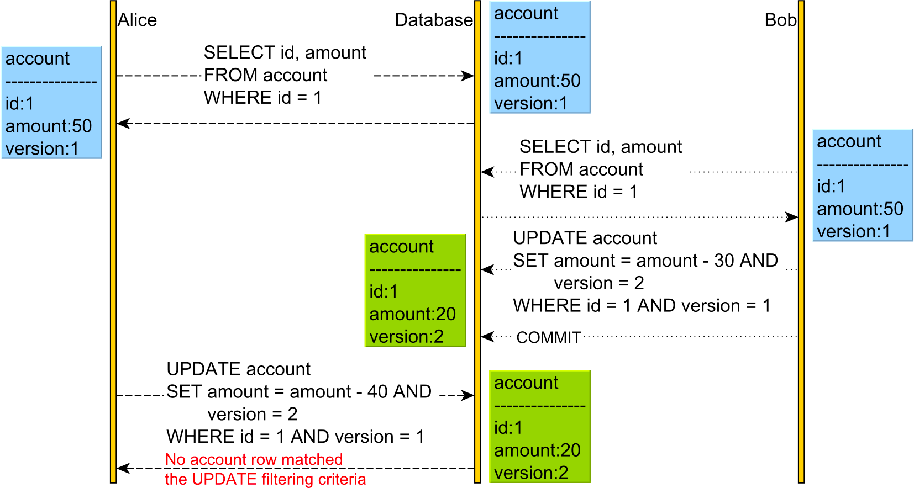
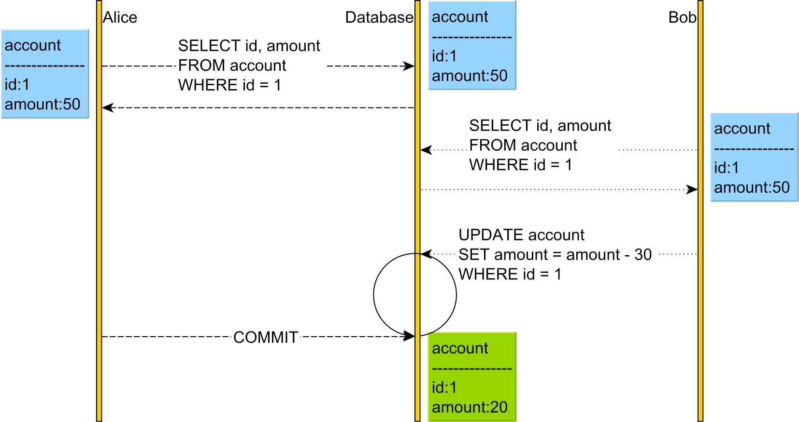

# Day 9 homework 8

## 8.1 optimistic lock and pessimistic lock
#### Optimistic Lock
* Optimistic Locking is a when you read a record, take note of a version number and check that the version hasn’t changed before you write the record back. 
* When you write the record back you filter the update on the version to make sure it’s atomic.
* Other transactions are able to concurrently access to the resource and the possibility of conflicting changes is possible. 
  * At commit time, when the resource is about to be updated in persistent storage, the state of the resource is read from storage again and compared to the state that was saved when the resource was first accessed in the transaction. 
  * If the two states differ, a conflicting update was made, and the transaction will be **rolled back**.

#### Example

So, when reading the account record, both users read its current version. However, when Bob changes the account balance, he also changes the version from 1 to 2.

Afterward, when Alice wants to change the account balance, her UPDATE statement will not match any record since the version column value is no longer 1, but 2.

Therefore, the executeUpdate method of the UPDATE PreapredStatement is going to return a value of 0, meaning that no record was changed, and the underlying data access framework will throw an OptimisticLockException that will cause Alice’s transaction to rollback.

So, the Lost Update is prevented by rolling back the subsequent transactions that are operating on state data.

#### Pessimistic Lock
* Pessimistic Locking is when you lock the record for your exclusive use until you have finished using it.
* It has much better integrity than optimistic locking but requires you to be careful with your application design to avoid Deadlocks.
* The disadvantage is that resource is locked from when you start the transaction until you finished the transaction. During that time the record is not available to other transactions.

#### Example

In the diagram above, both Alice and Bob will acquire a read (shared) lock on the account table row upon reading it.

Because both Alice and Bob hold the read (shared) lock on the account record with the identifier value of 1, neither of them can change it until one releases the read lock they acquired. This is because a write operation requires a write (exclusive) lock acquisition, and read (shared) locks prevent write (exclusive) locks.

For this reason, Bob’s UPDATE blocks until Alice releases the shared lock she has acquired previously.

### Reference
* https://medium.com/@saraswat.prateek1000/optimistic-v-s-pessimistic-locks-6be05ae97391
* https://vladmihalcea.com/optimistic-vs-pessimistic-locking/

## 8.2
#### Transaction
A transaction is a logical unit of work that contains one or more SQL statements. A transaction is an atomic unit. The effects of all the SQL statements in a transaction can be either all committed (applied to the database) or all rolled back (undone from the database).

#### How to solve the deadlock
Deadlock Characteristics
1. Mutual Exclusion 
2. Hold and Wait 
3. No preemption 
4. Circular wait
#### Deadlock Prevention
**Eliminate Mutual Exclusion**

It is not possible to dis-satisfy the mutual exclusion because some resources, such as the tape drive and printer, are inherently non-shareable.

**Eliminate Hold and wait**
1. Allocate all required resources to the process before the start of its execution, this way hold and wait condition is eliminated but it will lead to low device utilization. for example, if a process requires printer at a later time and we have allocated printer before the start of its execution printer will remain blocked till it has completed its execution.
2. The process will make a new request for resources after releasing the current set of resources. This solution may lead to starvation.

**Eliminate No Preemption**

Preempt resources from the process when resources required by other high priority processes.

**Eliminate Circular Wait**

Each resource will be assigned with a numerical number. A process can request the resources increasing/decreasing. order of numbering.

For Example, if P1 process is allocated R5 resources, now next time if P1 ask for R4, R3 lesser than R5 such request will not be granted, only request for resources more than R5 will be granted.

**Deadlock Avoidance**

Deadlock avoidance can be done with Banker’s Algorithm.

**Banker’s Algorithm**

Bankers’s Algorithm is resource allocation and deadlock avoidance algorithm which test all the request made by processes for resources, it checks for the safe state, if after granting request system remains in the safe state it allows the request and if there is no safe state it doesn’t allow the request made by the process.

Inputs to Banker’s Algorithm:
1. Max need of resources by each process. 
2. Currently, allocated resources by each process. 
3. Max free available resources in the system.

The request will only be granted under the below condition:
1. If the request made by the process is less than equal to max need to that process. 
2. If the request made by the process is less than equal to the freely available resource in the system.

#### Live lock (optional)
Livelock occurs when two or more processes continually repeat the same interaction in response to changes in the other processes without doing any useful work. These processes are not in the waiting state, and they are running concurrently. This is different from a deadlock because in a deadlock all processes are in the waiting state.

### Reference
* https://docs.oracle.com/cd/B19306_01/server.102/b14220/transact.htm#:~:text=A%20transaction%20is%20a%20logical,(undone%20from%20the%20database).
* https://www.geeksforgeeks.org/deadlock-prevention/
* https://www.geeksforgeeks.org/deadlock-starvation-and-livelock/

## 8.3 Saga
Saga simply sacrifices atomicity and relies on eventual consistency.

The Saga design pattern is a way to manage data consistency across microservices in distributed transaction scenarios. A saga is a sequence of transactions that updates each service and publishes a message or event to trigger the next transaction step. If a step fails, the saga executes compensating transactions that counteract the preceding transactions.

### Reference
* https://medium.com/trendyol-tech/saga-pattern-briefly-5b6cf22dfabc#:~:text=2PC%20works%20as%20a%20single,makes%20the%20data%20eventually%20consistent.
* https://docs.microsoft.com/en-us/azure/architecture/reference-architectures/saga/saga#:~:text=The%20Saga%20design%20pattern%20is,trigger%20the%20next%20transaction%20step.
* https://microservices.io/patterns/data/saga.html